<div id="top"></div>

[![Contributors][contributors-shield]][contributors-url]
[![Forks][forks-shield]][forks-url]
[![Stargazers][stars-shield]][stars-url]
[![Issues][issues-shield]][issues-url]
[![MIT License][license-shield]][license-url]
[![LinkedIn][linkedin-shield]][linkedin-url]

<!-- PROJECT LOGO -->
<br />
<div align="center">
  

  <h3 align="center">Todo List Provider</h3>

  <p align="center">
    Projeto de lista de tarefas criado no curso da Academia do Flutter, que ensina a utilizar o Provider para injeção de dependências e gerência de estados da aplicação.
    <br />
  </p>
</div>


<!-- TABLE OF CONTENTS -->
<details>
  <summary><b>Tabela de conteúdo</b></summary>
  <ol>
    <li>
      <a href="#about-the-project">Sobre o projeto</a>
      <ul>
        <li><a href="#built-with">Construído com</a></li>
      </ul>
    </li>
    <li>
      <a href="#getting-started">Iniciando</a>
      <ul>
        <li><a href="#prerequisites">Pré-requisitos</a></li>
        <li><a href="#installation">Instalação</a></li>
      </ul>
    </li>
    <li><a href="#usage">Uso</a></li>
    <li><a href="#contact">Contato</a></li>
  </ol>
</details>


<!-- ABOUT THE PROJECT -->
## Sobre o projeto

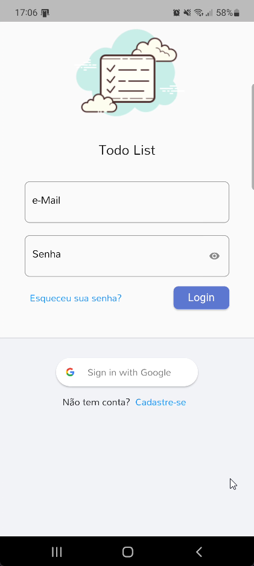
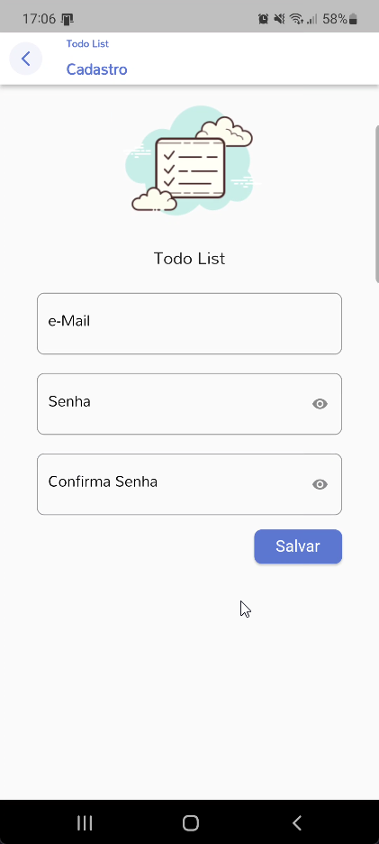
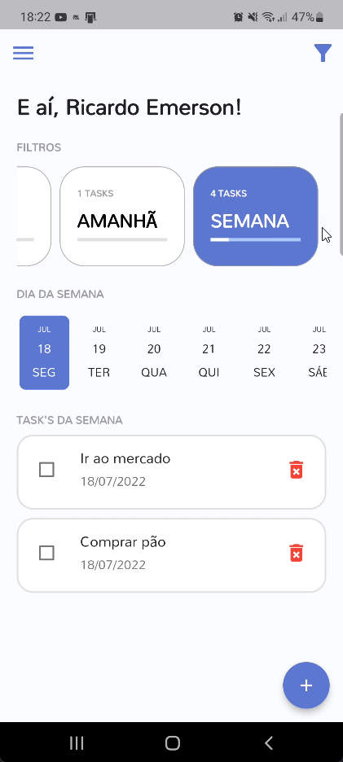
<br/>
<br/>


<!-- ABOUT THE PROJECT -->
## Sobre o projeto

Projeto de lista de tarefas criado no curso da Academia do Flutter, que ensina a utilizar o Provider para injeção de dependências e gerência de estados da aplicação.

<p align="right">(<a href="#top">back to top</a>)</p>


### Construído Utilizando


<p align="right">(<a href="#top">back to top</a>)</p>


<!-- GETTING STARTED -->
## Iniciando

Para que você possa executar o projeto é necessário que o Flutter na versão 3.0.5 esteja instalalado em seu sistema operacional.

Para facilitar esse processo o projeto está configurado com o FVM e uma vez que o FVM esteja instalado em seu sistema basta executar o comando `fvm install` e a versão 3.0.5 do Flutter já será instalada eu seu sistema.

### Pré-requisitos

Como pré-requisito para execução do projeto, será necessário que o Flutter na versão 3.0.5 esteja instalado e no meu canal do Youtube eu tenho um vídeo ensinando a como instalar o Flutter utilizando o FVM (Flutter Version Manager) que é um gerenciador de versões para o Flutter.

[![✅ [2022] Como instalar o FLUTTER com FVM para Windows e integrá-lo ao Visual Studio Code?](https://img.youtube.com/vi/d8p0nGxbAng/0.jpg)](https://youtu.be/d8p0nGxbAng)


### Instalação

1. No terminal, acesse a sua pasta de projetos e clone o repositório do Todo List:
   ```sh
   git clone https://github.com/ricardoemerson/todo_list_provider.git
   ```

2. Instale o Flutter 3.0.5:
   ```sh
   fvm install
   ```

3. Instale as dependências/packages do projeto
   ```sh
   fvm flutter pub get
   ```

4. Execute o projeto
   ```js
   fvm flutter run
   ```

<p align="right">(<a href="#top">back to top</a>)</p>


<!-- USAGE EXAMPLES -->
## Uso

O aplicativo permite o acesso através do cadastramento de usuário com e-mail e senha e também permite realizar a autenticação do usuário através da conta do Google.
<br/>


<br/>
<br/>

Ao acessar o aplicativo, serão exibidas as tarefas do Dia (Hoje) e também será possível visualizar as tafefas do dia seguinte (Amanhã) e da Semana.

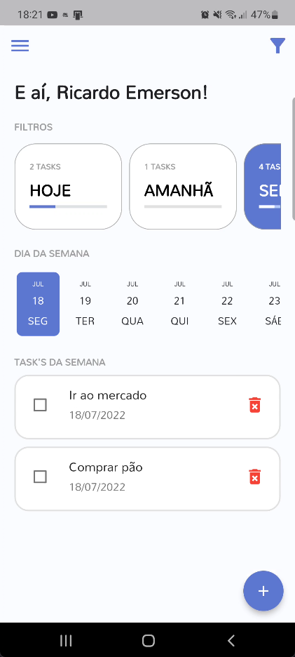
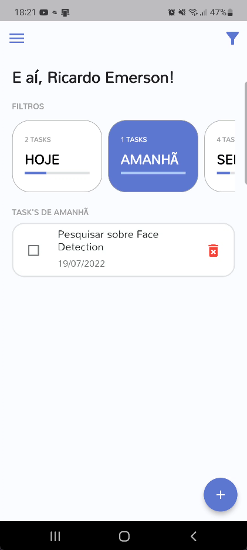


<br/>
<br/>

Caso não existam tarefas registradas o aplicativo apresentará uma mensagem informando.

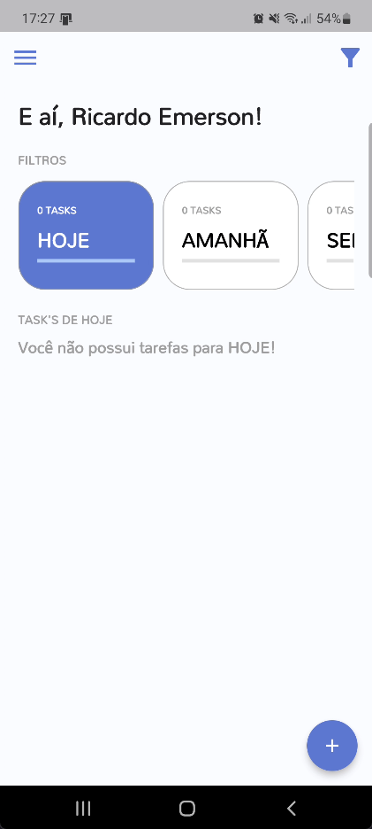


<br/>
<br/>

O usuário do sistema poderá a qualquer momento realizar a alteração do seu nome no aplicativo.

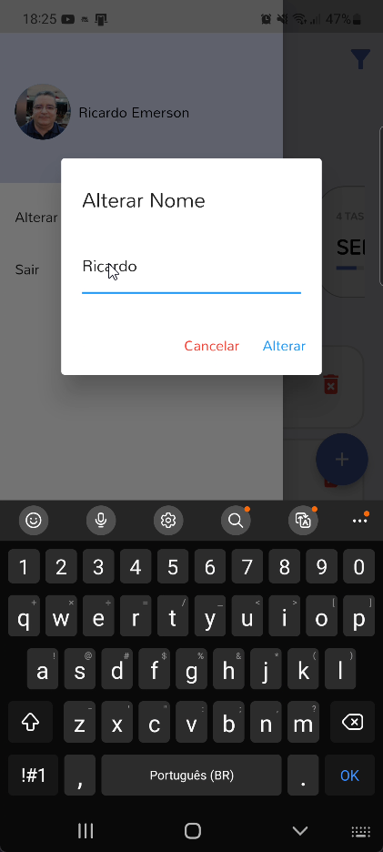

<br/>
<br/>

O usuário poderá criar suas tarefas informando o nome da mesma e a data da programada, bem como realizar a exclusão de uma tarefa registrada.

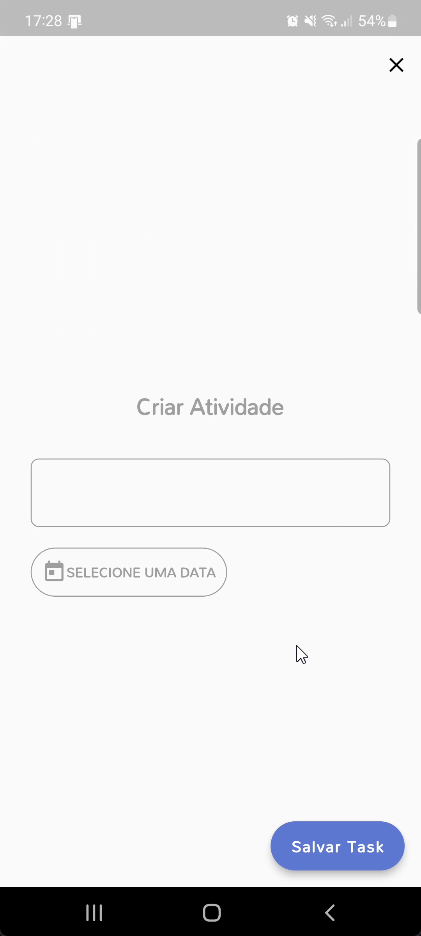
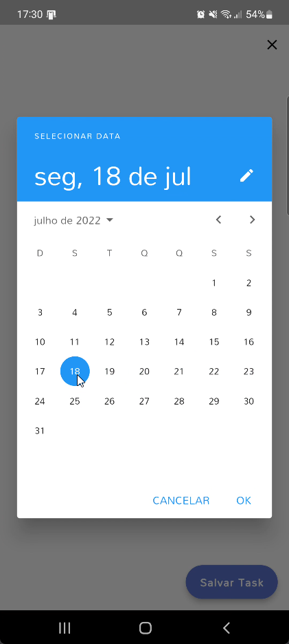
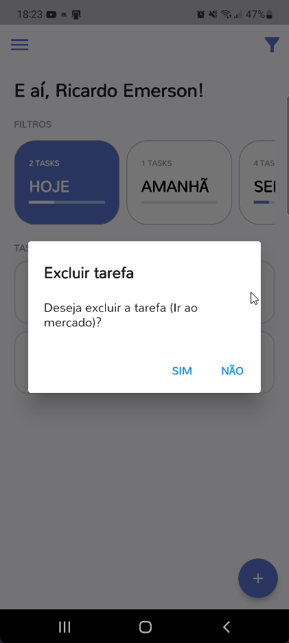

<br/>
<br/>

Também é possível através do Menu Popup de Filtragem exibir ou ocultar as tarefas já finalizadas.

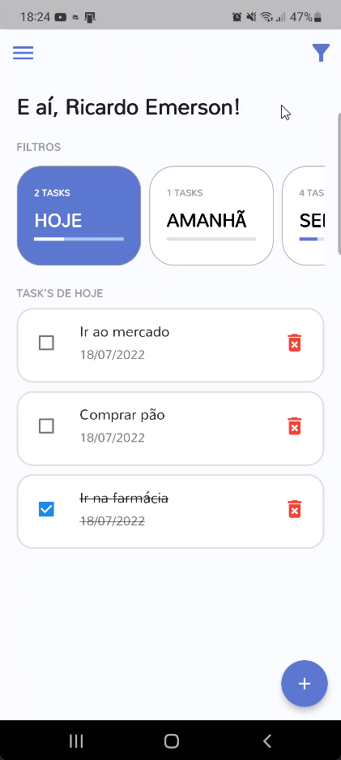

<br/>
<br/>

<p align="right">(<a href="#top">back to top</a>)</p>


<!-- CONTACT -->
## Contato

Ricardo Emerson - [@ricardo_emerson](https://twitter.com/ricardo_emerson) - ricardo_emerson@yahoo.com

Project Link: [https://github.com/ricardoemerson/todo_list_provider](https://github.com/ricardoemerson/todo_list_provider)

<p align="right">(<a href="#top">back to top</a>)</p>


<!-- MARKDOWN LINKS & IMAGES -->
<!-- https://www.markdownguide.org/basic-syntax/#reference-style-links -->
[flutter-shield]: https://img.shields.io/badge/Flutter-%2302569B.svg?style=for-the-badge&logo=Flutter&logoColor=white
[contributors-shield]: https://img.shields.io/github/contributors/ricardoemerson/todo_list_provider.svg?style=for-the-badge
[contributors-url]: https://github.com/ricardoemerson/todo_list_provider/graphs/contributors
[forks-shield]: https://img.shields.io/github/forks/ricardoemerson/todo_list_provider.svg?style=for-the-badge
[forks-url]: https://github.com/ricardoemerson/todo_list_provider/network/members
[stars-shield]: https://img.shields.io/github/stars/ricardoemerson/todo_list_provider.svg?style=for-the-badge
[stars-url]: https://github.com/ricardoemerson/todo_list_provider/stargazers
[issues-shield]: https://img.shields.io/github/issues/ricardoemerson/todo_list_provider.svg?style=for-the-badge
[issues-url]: https://github.com/ricardoemerson/todo_list_provider/issues
[license-shield]: https://img.shields.io/github/license/ricardoemerson/todo_list_provider.svg?style=for-the-badge
[license-url]: https://github.com/ricardoemerson/todo_list_provider/blob/master/LICENSE.txt
[linkedin-shield]: https://img.shields.io/badge/-LinkedIn-black.svg?style=for-the-badge&logo=linkedin&colorB=555
[linkedin-url]: https://linkedin.com/in/ricardojardim
[product-screenshot]: images/screenshot.png
[Next.js]: https://img.shields.io/badge/next.js-000000?style=for-the-badge&logo=nextdotjs&logoColor=white
[Next-url]: https://nextjs.org/
[React.js]: https://img.shields.io/badge/React-20232A?style=for-the-badge&logo=react&logoColor=61DAFB
[React-url]: https://reactjs.org/
[Vue.js]: https://img.shields.io/badge/Vue.js-35495E?style=for-the-badge&logo=vuedotjs&logoColor=4FC08D
[Vue-url]: https://vuejs.org/
[Angular.io]: https://img.shields.io/badge/Angular-DD0031?style=for-the-badge&logo=angular&logoColor=white
[Angular-url]: https://angular.io/
[Svelte.dev]: https://img.shields.io/badge/Svelte-4A4A55?style=for-the-badge&logo=svelte&logoColor=FF3E00
[Svelte-url]: https://svelte.dev/
[Laravel.com]: https://img.shields.io/badge/Laravel-FF2D20?style=for-the-badge&logo=laravel&logoColor=white
[Laravel-url]: https://laravel.com
[Bootstrap.com]: https://img.shields.io/badge/Bootstrap-563D7C?style=for-the-badge&logo=bootstrap&logoColor=white
[Bootstrap-url]: https://getbootstrap.com
[JQuery.com]: https://img.shields.io/badge/jQuery-0769AD?style=for-the-badge&logo=jquery&logoColor=white
[JQuery-url]: https://jquery.com
